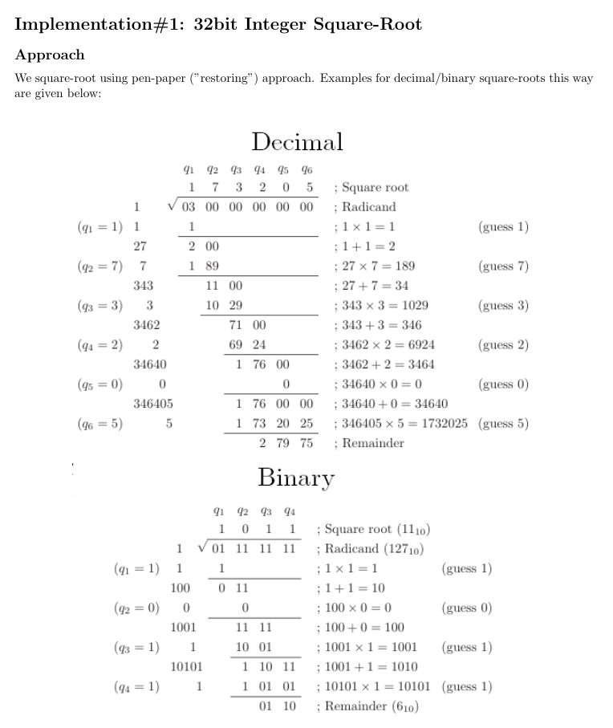
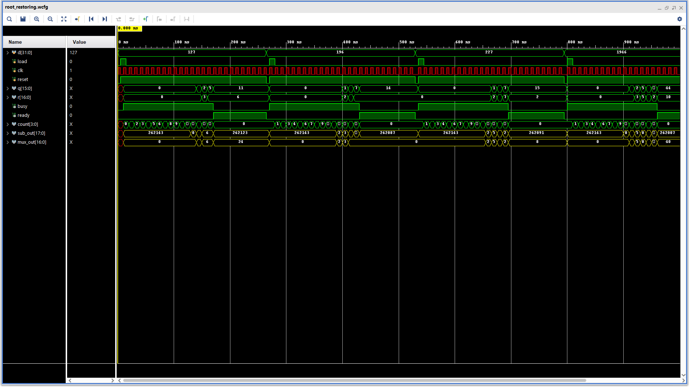
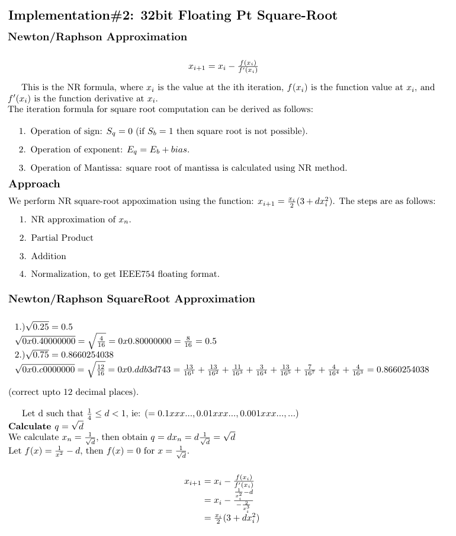
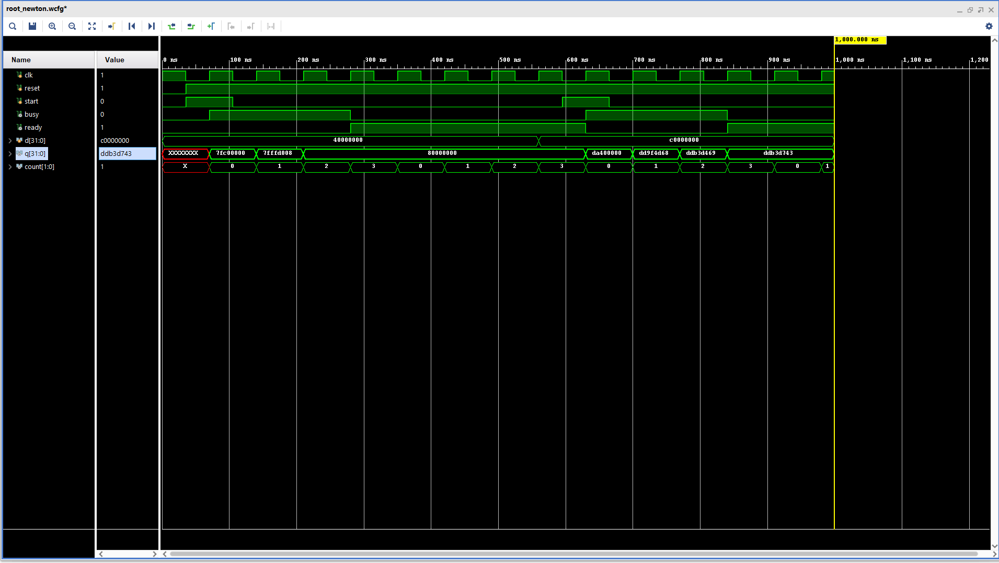
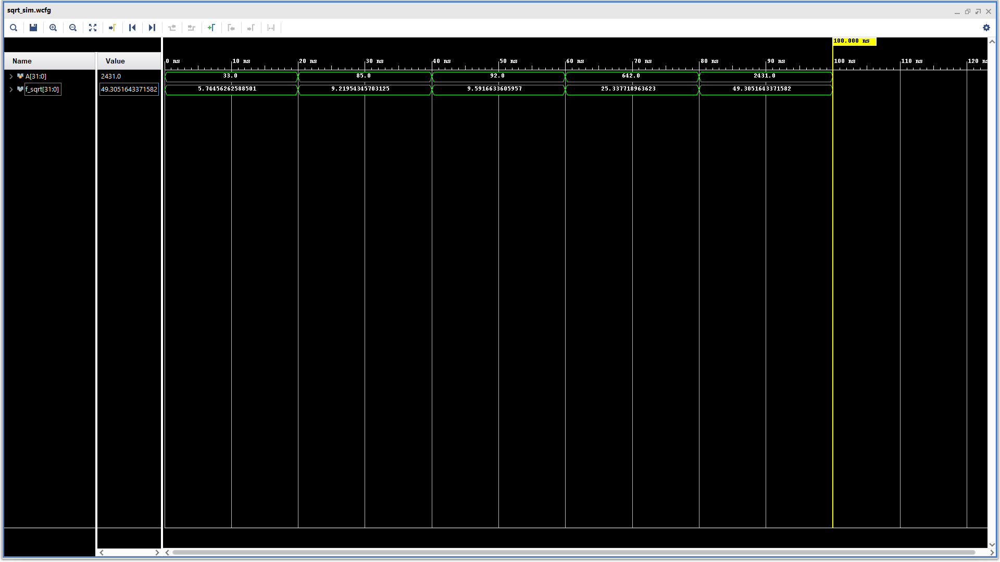
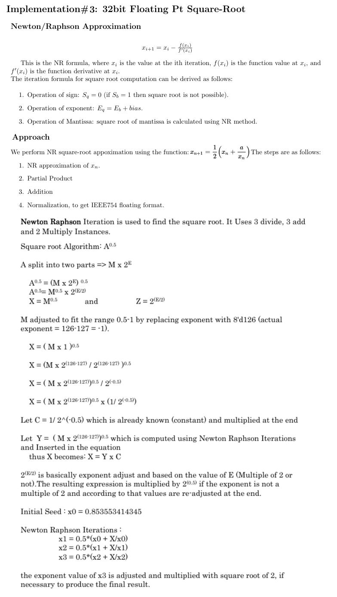
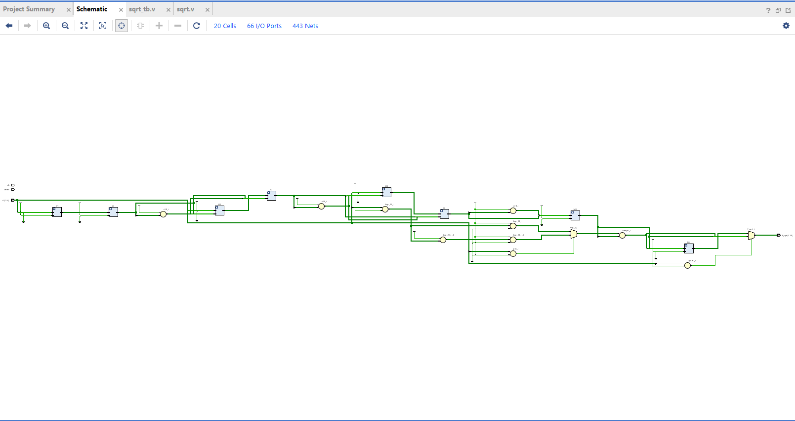
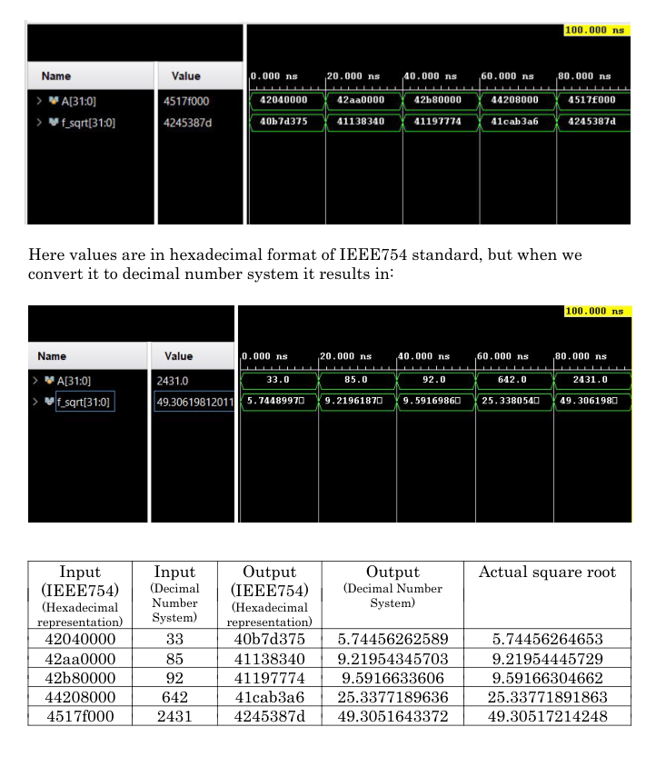

    Copyright(c) 2022-
    Author: Chaitanya Tejaswi (github.com/CRTejaswi)    License: GPL v3.0+

# FPGA: Floating Pt Square-Root
> 32bit integer square-root (restoring divison) & 32bit floating-pt square-root (newton-raphson) implementations on FPGA.

# Implementations

## [32bit integer sqrt](root_restoring.v):
__Documentation__: [📄](docs/v1.pdf)  
__Reports__: [timing](v1/reports/timing.txt), [power](v1/reports/power.txt)  
__Approach__:  

__Results__  

<!--   -->
<!--   -->
 
<!-- , SRL/SRA">  -->
<!--   -->
<!--   -->

## [32bit floating-pt: ](root_newton.v):
__Documentation__: [📄](docs/v2.pdf)  
__Reports__: [timing](v2/reports/timing.txt), [power](v2/reports/power.txt)  
__Approach__:  
Result is accumulated using `X[i+1] = Xi * (3 - Xi * Xi * d) / 2`. `1/sqrt(N)` is obtained from a pre-calculated LUT. This approach is the fastest; consumes lesser area too.

__Results__  

<!--   -->
<!--   -->
 
 
<!-- , SRL/SRA">  -->
<!--   -->
<!--   -->

## [32bit floating-pt: ](sqrt.v):

__Documentation__: [📄](docs/v3.pdf)  
__Reports__: [timing](v3/reports/timing.txt), [power](v3/reports/power.txt)  
__Approach__:  
(alternative approach) Result is accumulated using 4 stages - 3 iterations for partial sums, 1 for normalizing values to fit IEEE754 format (ie, multiply by √2 if E is odd ). The approach/partial sums are listed below:

__Results__  

 
 
<!-- , SRL/SRA">  -->
<!--   -->
<!--   -->

# References
